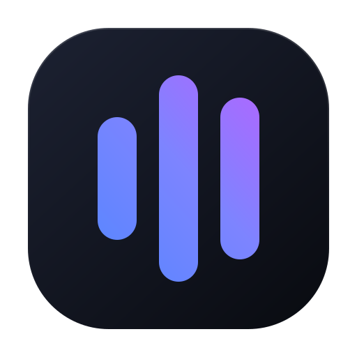
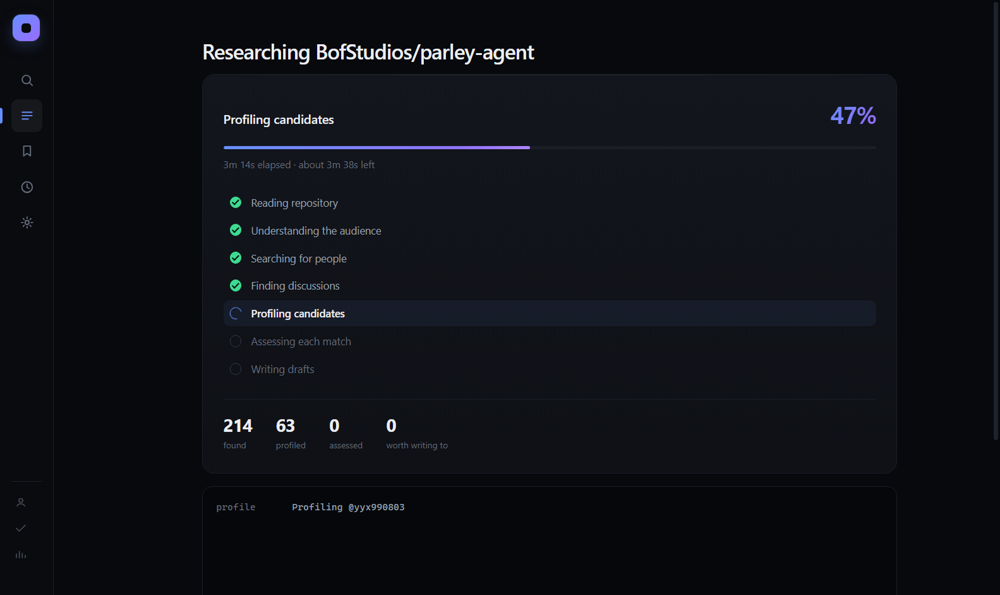
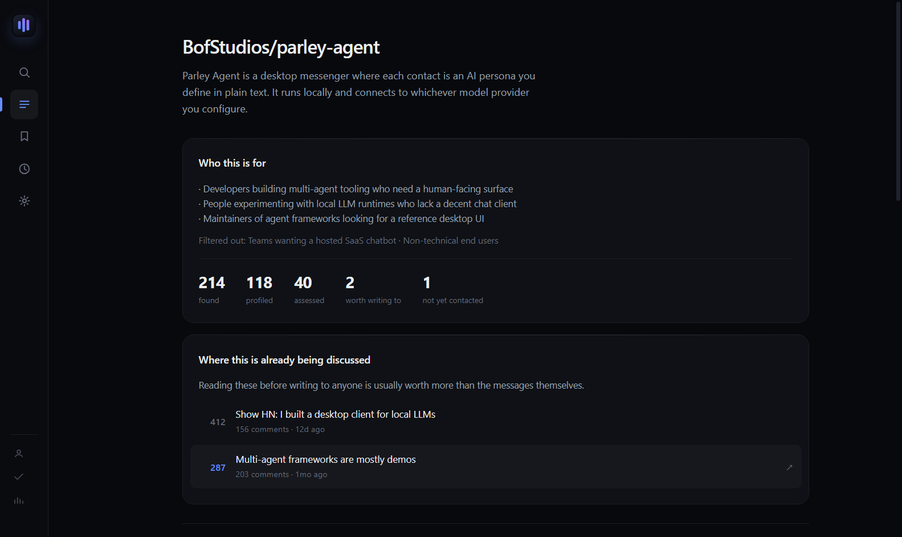
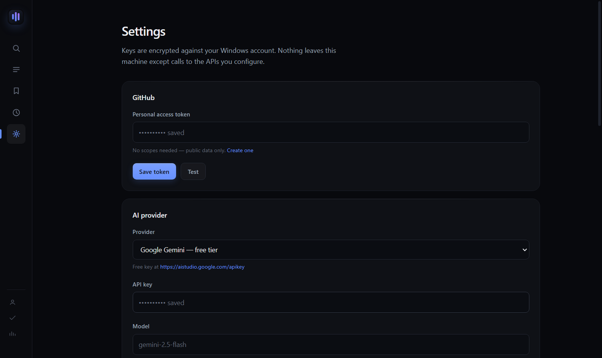

<div align="center">



# Chorus

**Find the developers who would genuinely care about your open-source project — and know why before you write to them.**

[](https://github.com/BofStudios/chorus/releases/latest)
[](LICENSE)


</div>

<br>

Chorus is a desktop app for maintainers who have built something good and have no idea how to tell anyone about it. It reads your repository, works out who it is actually for, finds those people through their public work, explains the connection, and drafts a message for each one.

Then it stops. You read the drafts, edit them, and send them yourself.

<br>



<br>



<br>

## What it does

| Step | What happens |
|---|---|
| **1. Reads your repo** | Pulls the description, topics, language and README through the GitHub API. |
| **2. Works out the audience** | An LLM turns that into a concrete audience description and a set of search queries — and is instructed to tell you when the audience is small. |
| **3. Finds people** | Searches neighbouring repositories, their contributors, developers who opened issues about this exact problem, and profiles that mention your keywords. |
| **4. Profiles each one** | Fetches their public profile and recent repositories. Filters out organisations, inactive accounts, and anyone you have contacted before. |
| **5. Scores the match** | Each person is assessed individually with a written rationale citing the specific repo or issue that justifies the score. Below your threshold, they are dropped. |
| **6. Drafts a message** | A personal message referencing that person's own work. If there is no honest reason to write to them, the model returns nothing and they are dropped. |
| **7. Hands it to you** | Copy button. You paste it wherever you decided to write. Mark them contacted so they never resurface. |

It also surfaces the Hacker News threads where your problem space is already being discussed — usually more valuable than any individual message.

A run reports itself properly while it works: overall percentage, the seven stages ticking off one by one, live counters, and a real estimate of the time left.

```
Profiling candidates                                    47%
████████████████████░░░░░░░░░░░░░░░░░░░░░░░
3m 14s elapsed · about 3m 38s left

✓ Reading repository          ✓ Finding discussions
✓ Understanding the audience  ◐ Profiling candidates
✓ Searching for people        ○ Assessing each match
                              ○ Writing drafts

214 found   63 profiled   0 assessed   0 worth writing to
```

<br>

## Depth

| Preset | Profiled | Assessed with AI | Time |
|---|---|---|---|
| **Quick** | 40 | 15 | 2–3 min |
| **Standard** | 120 | 40 | 6–9 min |
| **Deep** | 250 | 80 | 15–22 min |
| **Custom** | your number | your number | as long as it takes |

Deep is genuinely exhaustive: it widens the neighbouring-repo net, pulls contributors from sixteen projects instead of five, and assesses eighty people individually. It is slow because free model tiers are rate limited, not because it is idling.

**Custom has no ceiling.** Put 500 in either box if you want to. Chorus estimates the run time and API cost before you start, then throttles itself so it stays inside every documented rate limit rather than getting your token blocked. Nothing in the app caps how many people you can research or write to — the only number that ever appears as a limit is one you typed in yourself.

<br>

## The browser extension

A companion Chrome extension (in [`extension/`](extension/)) adds a **Send to Chorus** button to GitHub profile and repository pages. When you find someone interesting while browsing, one click queues them in the desktop app's **Watchlist**, where you can assess and draft for them individually.

It is deliberately dumb: it reads the page you are already looking at, and only acts when you click. It cannot browse, scrape, follow, or message anyone.

The popup knows the state of your setup: if the desktop app is running it shows your watchlist count and can bring the window to the front over a `chorus://` handler the app registers. If the app is not running, it offers the download instead.



**Install it:**

1. Open `chrome://extensions`
2. Turn on **Developer mode** (top right)
3. **Load unpacked** → pick the `extension` folder
4. Open Chorus → Settings → Extension, copy the pairing code, paste it into the extension popup

**How it connects:** the desktop app runs a small HTTP server bound to `127.0.0.1` only — never the network. Every endpoint except `/ping` requires the pairing token, which you can rotate at any time. The extension can hand over a username; it cannot read your campaigns, start research, or make the app send anything.

**Publishing it to the Chrome Web Store:** the upload zip is built with `npm run pack:extension` and every field the submission form asks for is pre-written in [STORE-LISTING.md](STORE-LISTING.md), with the privacy policy in [PRIVACY.md](PRIVACY.md).

<br>

## What it deliberately does not do

- It does not log into any account, anywhere.
- It does not send messages, follow, subscribe, or like anything.
- It does not automate a browser or emulate a human clicking.
- It does not scrape. Every source is an official, documented, public API.
- It does not use GitHub's stargazer or watcher endpoints — [GitHub restricted those in June 2026](https://github.blog/changelog/2026-06-30-upcoming-access-restrictions-to-public-api-endpoints-and-ui-views/) precisely because they were being harvested to spam developers.

The design assumption is that twenty messages a human wrote and sent beat two thousand a bot did — and that the second kind is what got the useful APIs closed in the first place.

<br>

## Install

**Just want to use it?** Grab the [latest release](https://github.com/BofStudios/chorus/releases/latest) — take the installer, or the portable build if you would rather not install anything. Windows will warn about an unknown publisher because the binaries are unsigned; choose **More info → Run anyway**.

**Building it yourself:**

```bash
git clone https://github.com/BofStudios/chorus.git
cd chorus
npm install
npm start
```

Build a Windows installer and portable `.exe`:

```bash
npm run dist
```

Output lands in `dist/`.

Check that every upstream API still behaves as expected — useful before you trust a run:

```bash
npm run test:sources
```

Test the extension bridge (auth, validation, deduplication, token rotation):

```bash
npm run test:bridge
```

<br>

## Setup

### GitHub token — recommended

Without one you get 60 API requests per hour, which is roughly one small run. With one you get 5,000.

Create a token at [github.com/settings/tokens](https://github.com/settings/tokens). **No scopes are required** — Chorus only reads public data. Paste it into Settings → GitHub.

### AI provider — optional

On first launch Chorus walks you through this: it opens the provider's key page, you paste the key, and it validates it immediately rather than letting you discover it was wrong forty calls into a run.

Chorus runs without any AI key using built-in heuristics, but the scoring and drafts are noticeably rougher. Free options:

| Provider | Free tier | Get a key |
|---|---|---|
| **Google Gemini** | Yes, generous | [aistudio.google.com/apikey](https://aistudio.google.com/apikey) |
| **Groq** | Yes | [console.groq.com/keys](https://console.groq.com/keys) |
| **OpenRouter** | Free models available | [openrouter.ai/keys](https://openrouter.ai/keys) |
| **Anthropic** | Paid | [console.anthropic.com](https://console.anthropic.com/settings/keys) |

Keys are encrypted with Electron's `safeStorage`, which on Windows binds them to your user account via DPAPI. They are never sent anywhere except the provider you chose.

<br>

## Cost of a run

A default run (80 people profiled, 25 assessed) uses roughly:

- **~200 GitHub API requests** — 4% of the hourly budget with a token
- **~51 model calls** — 1 analysis, 25 scores, 25 drafts

Search endpoints are limited to 30 requests/minute, so a full run takes a few minutes. Chorus throttles itself to stay well inside every documented limit and shows the remaining quota in the sidebar.

<br>

## Tuning it

| Setting | Effect |
|---|---|
| **People to profile** | Size of the candidate pool. Higher = slower, more API budget. |
| **People to assess with AI** | How many get a real evaluation. This is what costs model calls. |
| **Minimum score** | Below 55 the connection is usually too thin to write about honestly. |
| **Active within** | Skips people who stopped pushing code. |
| **Require contact channel** | Only keep people with a public email, site, or Twitter on their profile. |
| **Message tone** | `peer`, `brief`, `warm`, or `formal`. |
| **Extra instructions** | Free text appended to the drafting prompt. |

If a run returns nobody, that is a real answer. Lower the threshold, sharpen the pitch, or reconsider whether the audience exists — but do not read it as a bug.

<br>

## Where your data lives

Everything is local, in your Electron `userData` directory:

```
config.json    settings
secrets.bin    API keys, encrypted
data.json      campaigns, targets, drafts, contact ledger
```

The contact ledger is the one that matters: it remembers everyone you have marked as contacted, across every campaign, so the same person is never surfaced twice.

<br>

## Architecture

```
src/main/
  index.js          window + lifecycle
  ipc.js            typed IPC surface
  store.js          config + safeStorage secrets
  db.js             campaigns, targets, watchlist, contact ledger
  http.js           throttling, retry, rate-limit tracking
  progress.js       weighted stage tracker
  research.js       the pipeline
  ai.js             provider abstraction + the three prompts
  bridge.js         127.0.0.1 server for the extension
  sources/
    github.js       official REST API
    hackernews.js   Algolia public index
src/preload/        contextBridge surface
src/renderer/       plain DOM, no framework
extension/          Manifest V3 Chrome extension
scripts/            live API and bridge tests
```

Context isolation is on, node integration is off, and a strict CSP is enforced — including no inline styles, which is why the renderer uses utility classes and sets dynamic widths through the CSSOM. All external links open in the real browser.

<br>

## Licence

MIT © BofStudios
